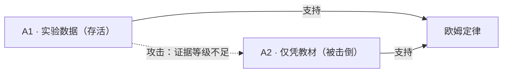

# 存储格式

> 一个知识点 = 一个 `.md` 文件。`front-matter` 存机器需要的，正文存人需要的。
> 本文档的规则由 [`tools/kbcheck.py`](tools/kbcheck.py) 强制校验。

---

## 1. 三条硬规矩

1. **一个知识点 = 一个文件。** 不合并、不拆散。这样 PR diff 干净、争议定位准。
2. **同一个事实不写两处。** `front-matter` 存机器需要的，正文存人需要的。
3. **正文段落顺序固定**，机器才能可靠抽取。
   `## 论证` 小节**所有类型都必须存在**（草案下可为空并注明「尚无论证」）。

## 2. 目录结构

```
knowledge/
└─ <学科>/
   ├─ README.md         学科索引
   ├─ 知识点/           **概念节点**：承载先修关系；教法挂在其下
   ├─ 命题/             有真假、需要收敛的知识主张
   ├─ 教法/             教学做法，条件性有效，**不收敛**，必填禁忌
   ├─ 误解/             常见错误概念，是教学资产
   ├─ 路径/             知识点的编排，含先修约束与目标
   └─ 资源/             图示、动画、例题、习题
evidence/
├─ README.md           证据索引
└─ <原始数据文件>
```

### 为什么要有一层 `知识点`（而不是把先修挂在教法上）

教法是 **(知识点 × 水平档)** 的组合——同一知识点会有多个教法文件：

```
知识点/参考系.md                    ← 概念节点，先修边连这里
教法/参考系-BL-多参考点观察.md
教法/参考系-OL-提问引导.md
教法/参考系-AL-生成式下定义.md
```

而「参考系先于速度与速率」是**知识点之间**的关系，**与水平档无关**。
若先修边挂在教法条目上，就会被迫写成「位置时间图-BL 先修 速度与速率-BL」，
**把档位绑进了先修关系**。

> [!IMPORTANT]
> **先修边只连 `知识点`。** 这是硬规则，由 `tools/kbcheck.py` 校验。
> 背景见 [Issue #11](https://github.com/hpleapfrog/Scholia/issues/11)。

> [!IMPORTANT]
> **命名约定：系统目录用英文，内容目录用中文。**
>
> `knowledge/` `evidence/` `tools/` 是系统目录——机器和脚本要稳定引用它们，所以用英文。
> `物理/` `命题/` `教法/` 是内容目录——给人看的，所以用中文。
> 文件名同理：系统文件用英文（`README.md` `FORMAT.md`），知识条目用中文（`欧姆定律.md`）。

`evidence/` 在仓库根目录，为全库共享。

### 命名与链接

- 文件名用**中文可读名**，因为它是给人看的
- 稳定标识放在 `id` 字段里（如 `kb:physics:ohm-law`），因为中文文件名在 URL 里会被转义
- 内部链接用**相对路径 Markdown 链接**：`[电流](../命题/电流.md)`
- **不要用 `[[双链]]`**——那是 Obsidian 的私有扩展，GitHub 不渲染

## 3. `front-matter`

字段名用英文（便于脚本与 AI 稳定解析）。以下 **11 个字段全部必填**：

| 字段 | 含义 |
|---|---|
| `id` | 稳定标识，重命名文件也不变。**`id` 刻意不含项目名**——fork 出去后标识必须保持不变 |
| `type` | 六类对象之一（`知识点` `命题` `教法` `误解` `路径` `资源`） |
| `title` | 人类可读标题 |
| `status` | 状态，取值受 `type` 约束（见 §4） |
| `author` | 最后一位实质性改动者。**不可匿名** |
| `created` / `updated` | 时间戳。**仅提示，不参与排序** |
| `scope` | 适用范围。缺了它，任何结论都会被误用 |
| `edges` | `先修` / `支持` / `攻击` |
| `evidence` | 证据编号，对应 `evidence/README.md` |
| `license` | 授权与再分发条款 |

```yaml
---
id: kb:physics:ohm-law
type: 命题
title: 欧姆定律
status: 已确证
author: "@alice"
created: 2026-09-09
updated: 2026-09-15
scope:
  学科: 物理
  学段: 初中
  适用: 全体
  条件: 温度恒定
edges:
  先修: ["[电流](电流.md)"]
  支持: []
  攻击: []
evidence: [ev-001, ev-002]
license: CC-BY-SA-4.0
---
```

## 4. 状态取值（受 `type` 约束）

| `type` | 允许的 `status` |
|---|---|
| 命题 | 草案 · 待审 · 争议 · 暂定确认 · **已确证** · 已推翻 · **失据** · 需复审 · 已失效 |
| 知识点 · 路径 | 草案 · 待审 · 有效 · 争议 · 需复审 · 已失效 |
| 教法 · 误解 · 资源 | 草案 · 待审 · 有效 · 争议 · 需复审 · 已失效 |

> [!IMPORTANT]
> **知识点、教法、误解、路径、资源禁止使用「已确证」。**
> 它们是组织层或条件性的，不存在唯一正确。允许教法用「已确证」，就等于承认存在唯一最优教法。
> 只有 `命题` 可以「已确证」。

### `教法` 的额外必填字段

`教法` 条目**必须**有 `knowledge_point`，指向它所属的 `知识点`：

```yaml
type: 教法
knowledge_point: ["[参考系](../知识点/参考系.md)"]
```

`tools/kbcheck.py` 会校验该链接**必须指向一个 `知识点` 类型的条目**。

### `路径` 的额外必填字段：`outcomes`

`路径` 必须声明**可观测的学习成果**（编号 `o1` `o2` …），并在 `## 编排` 表里为每个环节标注它覆盖哪些成果：

```yaml
outcomes:
  - o1: 能说出「描述运动必须先指定参考系」
  - o2: 能区分速率与速度（速度含方向）
  - o3: 能画出一个简单运动的位置-时间图
```

```markdown
| # | 环节 | 条目 | 覆盖 | 时长 |
|---|---|---|---|---|
| 1 | 建立参考系 | [...] | o1 | 15 min |
| 2 | 诊断：参考系是不是「背景」 | [...] | — | 5 min |
| 3 | 速度与速率的日常用法 | [...] | o2 | 15 min |
```

**校验器会检查**：每个声明的成果是否**至少被一个环节覆盖**。

> [!IMPORTANT]
> **没被覆盖的成果是错误，不是提示。**
> 那意味着这条路径**达不成它自己声明的目标**。
>
> 这让「目标覆盖度」从**人工判断**变成**机械校验**——它原是四项路径自检里最后一项没有机制的。

未声明 `outcomes` 的路径会得到**警告**，并注明「目标覆盖度仍是人工判断」。

### 跨学段 `先修` 边

`先修` **允许跨学段**——它是概念关系，不受学段划分限制。

但校验器会对跨学段边输出**警告**（不阻塞），要求作者确认这是**概念前置**，
而不是**「进阶 / 深化」**关系：

> 「先修」= 时间顺序上必须先学；「进阶」= 同一主题的层次深化。**两者不是一回事。**

> [!NOTE]
> 本库目前**没有**表达「进阶」关系的手段。若跨学段边多到一定数量，
> 说明需要引入这一关系——**在出现真实需求之前不预先设计。**

## 5. 必备小节

| `type` | 必须包含的 `##` 小节 |
|---|---|
| 知识点 | 定义 · 关联 · 变更记录 |
| 命题 | 陈述 · 依据 · 论证 · 变更记录 |
| 教法 | 做法 · **禁忌** · **风险** · 证据 · 论证 · 变更记录 |
| 误解 | 陈述 · 出现频率 · 变更记录 |
| 路径 | 编排 · 自检 · 变更记录 |
| 资源 | 定位 · 变更记录 |

### `教法` 的两个小节必须分清

这是本库最容易混的一对概念：

| 小节 | 回答的问题 | 维度 |
|---|---|---|
| `## 禁忌` | **对谁不适用？** | 人群 / 适用性 |
| `## 风险` | **用这个方法会怎么翻车？** | 做法本身 |

**为什么必须拆开**：`路径` 的「禁忌冲突」自检要判断「所选教法在本画像下是否被标注为**不适用**」。
如果 `禁忌` 里装的是风险，这项自检就**永远判不了**。背景见
[Issue #13](https://github.com/hpleapfrog/Scholia/issues/13)。

> [!IMPORTANT]
> **`禁忌` 必须标注证据强度。**
> 「教材没提别的档位」**不等于**「别的档位不适用」——那是过度推断。
> 拿不出强证据时就如实写**弱**，不要编。

**所有类型都必须有 `## 论证`**（草案下可留空）。

> [!IMPORTANT]
> **必备小节存在 ≠ 内容必须充分。**
> 拿不出内容时，**保留小节并写明「暂无数据」**，不要删掉小节，也不要放宽规则。
>
> 例如 `误解` 类的 `## 出现频率`：没有实测数据时，写「暂无量化数据——现有依据只能证明
> 教材标注了这条教学提示，**证明不了误解率**」。
> **让缺口可见，是诚实的做法；把规则放宽，是掩盖缺口。**

## 6. 状态由谁写

规则是死的，执行者是人：

```
1. 列出该条目的所有论证，标出谁攻击谁
2. 求存活集合：攻击者全部被击倒的论证才算「存活」
3. 存活集合结论一致  → 已确证（需一名非作者的独立复核）
   存活集合存在冲突  → 争议
   存活集合为空      → 见下（要分成因）
4. 把 status 与依据写进 PR 描述与「变更记录」表
```

### 「存活集合为空」有两种成因，不能压成一个状态

| 成因 | 状态 | 含义 |
|---|---|---|
| **从未有人论证过** | `待审` | 新条目，还没人搭论证 |
| **曾有论证，但被击倒了** | **`失据`** | 主张仍在，但当前**没有支撑它的论证**；反证也未推翻它 |

> [!IMPORTANT]
> **`失据` 是实算之后才补上的状态。**
>
> 规则最初只写了「存活集合为空 → 待审」。真跑一次才发现：
> 那会把「新条目」和「论证刚被打掉」压成同一个状态——
> **攻击的后果在 `status` 上完全不可见**，而攻击正是本库的核心机制。
>
> 读到一个 `失据` 的条目，读者知道**它曾经有人论证过，而那个论证站不住了**。

### 论证必须带 ID，攻击必须落到论证上

`## 论证` 下的每个论证小节必须写成 `### <ID> · <标题>`，ID 形如 `A1` `M2` `K3`
（`[A-Z]+\d+`）。同一文件内 ID 不得重复。

`支持` / `攻击` 边**必须带论证锚点**：

```yaml
edges:
  攻击: ["[命题：n=2 无法归因](../命题/两个样本无法归因.md#a1)"]
```

- 只指向条目**是无效的**——无法定位被攻击的是哪条论证
- 锚点用小写（`#a1` 对应 `### A1`）
- `tools/kbcheck.py` 会校验：目标条目存在 + 该锚点确实是目标条目里的一个论证 ID

> [!NOTE]
> **一次攻击自己也是一个可被攻击的论证。** 攻击方是独立条目，
> 有自己的 `## 论证`、自己的状态、自己的被击倒方式——
> 这正是「谁攻击谁」能被画成图的前提。

**四种有效攻击**（必须机械可检）：

1. **前提不实** —— `grounds` 中某条事实不成立
2. **推理无效** —— 从 `grounds` 到 `claim` 有逻辑断层
3. **证据不足** —— 证据等级撑不起结论
4. **提出更强反证** —— 更高等级、且指向同一 claim

**举证责任刻意不对称**：主张方必须举证；反驳方只需指出一处致命漏洞即算有效。**可反驳性优先于可确证性。**

### AI 可以当攻击方，不能当复核者

本库**接受 AI 生成的攻击**，但界限很清楚：

| 角色 | 举证责任 | AI 合适吗 |
|---|---|---|
| **攻击方** | 只需指出**一处**致命漏洞 | ✅ **合适** |
| **复核者**（用于写入 `已确证`） | 必须**正面举证**结论成立 | ❌ **不合适** |

**这个不对称不是巧合，是设计出来的**：本库刻意让「反驳」比「确认」容易。
攻击方只需找到一条裂缝；确认者要对整条论证负责。

**AI 特别不适合当确认者，有三个理由：**

1. **它倾向于附和** —— 问它「这个对吗」，它多半说对。**附和不是证据。**
2. **它与原作者共享训练偏差** —— 同一个语料带来的误解，会让 AI 与原作者的「一致」成为**假独立**
3. **它没有可被追问的主体** —— 结论错了，追问不到谁

> [!IMPORTANT]
> **所以 `已确证` 仍然是人的门。** 这不是保守，是因为「独立复核」这个词
> 要求的正是 AI 给不了的那样东西：**一个能被追问的责任主体**。

**AI 攻击入库前必须过三关：**

| # | 关 | 要求 |
|---|---|---|
| 1 | **人复核** | 作者必须自己判断这条攻击是否成立。**AI 说的不等于成立** |
| 2 | **署名披露** | `author` 必须写明是 AI（模型名 · 日期），正文说明**由谁复核、复核了什么** |
| 3 | **可被反击** | AI 的攻击与人的攻击**地位完全相同**——它自己也是可被攻击的论证 |

> [!TIP]
> **被驳回的 AI 攻击也是资产。**
>
> 如果一条 AI 攻击站不住，**不要删掉它**——把它记为「已被击倒的攻击」，
> 并写明**为什么站不住**。这样下一个人（或下一个 AI）不会重复提同一个漏洞。
>
> **这与本库对待作废证据的态度一致：删掉痕迹才是真的丢信息。**

### `支持` 边的条数**不代表**强度

`支持` 边记录「谁的论证支撑了谁的论证」。但有一条硬规矩：

> [!IMPORTANT]
> **来自同一来源的多个实例，不是独立证据。**

**别把条数写进条目。** `kbcheck.py` 会实时报出进边数——**写死在正文里会漂移**。

> [!CAUTION]
> **本库犯过这个错。** 命题「教材内建分组教学变体」的正文里曾写「A1 **现在有 15 条**支持边」，
> 而实测**已达 26 条且仍在增长**。**「现在有」＋一个会漂移的数字＝把快照写成了断言。**
> 该命题的 A1 因此被 [一条攻击](knowledge/物理/命题/攻击-教材内建分组教学变体.md) 打中。
> **本规范自身也曾把这个数字当例句引用——同样已修正。**

| 看似 | 实际 |
|---|---|
| 26 条支持 ⇒ 证据很强 | ❌ **同一个来源重复 26 次** |
| 3 条支持 ⇒ 证据较弱 | ✅ 若来自 3 个不同国家/出版社，**强于上面那 26 条** |

**独立性的判据是来源，不是条数。** `kbcheck.py` 会报出进边条数并附上这条提醒——
**但它算不出独立性**（来源归属是自由文本）。**这一项必须由人判断。**

> [!NOTE]
> 这已经是本库**第二次**撞到同一类问题：第一次是命题「类比的选择与学段相关」被攻击
> （n=2 无法分离同样变化的变量）。**两次的教训是同一条：
> 同一来源的多个观测，不等于多份证据。**

## 7. GitHub 原生特性

### 争议标记

```markdown
> [!WARNING]
> **此处存在争议**：存活论证结论相反，尚无更强证据决出胜负。
```

| alert | 用途 |
|---|---|
| `[!WARNING]` | 存在争议 |
| `[!CAUTION]` | 禁忌、法律与安全风险 |
| `[!IMPORTANT]` | 规则性约束 |
| `[!NOTE]` / `[!TIP]` | 补充说明 |

### 论证图

Mermaid 会被 GitHub 原生渲染，直接写在 `.md` 里就能看：

````markdown

````

### 证据

- 原始数据、脚本放进 `evidence/`，用相对链接引用
- **禁止上传教材原文或扫描页**

## 8. 免责

格式规范采用 **MIT**（见 [LICENSE-CODE](LICENSE-CODE)）：
**如果格式本身带共享条款，别人实现它就会有法律顾虑——那等于亲手阻止自己的格式成为标准。**
