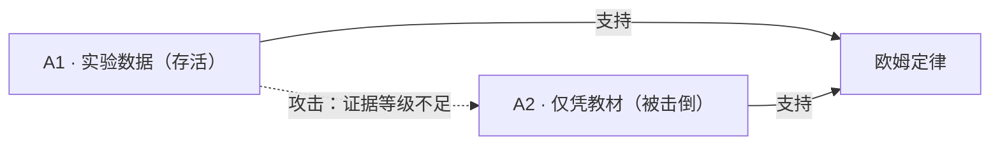

# 存储格式

> 一个知识点 = 一个 `.md` 文件。`front-matter` 存机器需要的，正文存人需要的。
> 本文档的规则由 [`tools/kbcheck.py`](tools/kbcheck.py) 强制校验。

---

## 1. 三条硬规矩

1. **一个知识点 = 一个文件。** 不合并、不拆散。这样 PR diff 干净、争议定位准。
2. **同一个事实不写两处。** `front-matter` 存机器需要的，正文存人需要的。
3. **正文段落顺序固定**，机器才能可靠抽取。
   `## 论证` 小节**所有类型都必须存在**（草案下可为空并注明「尚无论证」）。

## 2. 目录结构

```
knowledge/
└─ <学科>/
   ├─ README.md         学科索引
   ├─ 命题/             有真假、需要收敛的知识主张
   ├─ 教法/             教学做法，条件性有效，**不收敛**，必填禁忌
   ├─ 误解/             常见错误概念，是教学资产
   ├─ 路径/             知识点编排，含先修约束与目标
   └─ 资源/             图示、动画、例题、习题
evidence/
├─ README.md           证据索引
└─ <原始数据文件>
```

> [!IMPORTANT]
> **命名约定：系统目录用英文，内容目录用中文。**
>
> `knowledge/` `evidence/` `tools/` 是系统目录——机器和脚本要稳定引用它们，所以用英文。
> `物理/` `命题/` `教法/` 是内容目录——给人看的，所以用中文。
> 文件名同理：系统文件用英文（`README.md` `FORMAT.md`），知识条目用中文（`欧姆定律.md`）。

`evidence/` 在仓库根目录，为全库共享。

### 命名与链接

- 文件名用**中文可读名**，因为它是给人看的
- 稳定标识放在 `id` 字段里（如 `kb:physics:ohm-law`），因为中文文件名在 URL 里会被转义
- 内部链接用**相对路径 Markdown 链接**：`[电流](../命题/电流.md)`
- **不要用 `[[双链]]`**——那是 Obsidian 的私有扩展，GitHub 不渲染

## 3. `front-matter`

字段名用英文（便于脚本与 AI 稳定解析）。以下 **11 个字段全部必填**：

| 字段 | 含义 |
|---|---|
| `id` | 稳定标识，重命名文件也不变。**`id` 刻意不含项目名**——fork 出去后标识必须保持不变 |
| `type` | 五类对象之一 |
| `title` | 人类可读标题 |
| `status` | 状态，取值受 `type` 约束（见 §4） |
| `author` | 最后一位实质性改动者。**不可匿名** |
| `created` / `updated` | 时间戳。**仅提示，不参与排序** |
| `scope` | 适用范围。缺了它，任何结论都会被误用 |
| `edges` | `先修` / `支持` / `攻击` |
| `evidence` | 证据编号，对应 `evidence/README.md` |
| `license` | 授权与再分发条款 |

```yaml
---
id: kb:physics:ohm-law
type: 命题
title: 欧姆定律
status: 已确证
author: "@alice"
created: 2026-09-09
updated: 2026-09-15
scope:
  学科: 物理
  学段: 初中
  适用: 全体
  条件: 温度恒定
edges:
  先修: ["[电流](电流.md)"]
  支持: []
  攻击: []
evidence: [ev-001, ev-002]
license: CC-BY-SA-4.0
---
```

## 4. 状态取值（受 `type` 约束）

| `type` | 允许的 `status` |
|---|---|
| 命题 | 草案 · 待审 · 争议 · 暂定确认 · **已确证** · 已推翻 · 需复审 · 已失效 |
| 路径 | 草案 · 待审 · 有效 · 争议 · 需复审 · 已失效 |
| 教法 · 误解 · 资源 | 草案 · 待审 · 有效 · 争议 · 需复审 · 已失效 |

> [!IMPORTANT]
> **教法、误解、资源禁止使用「已确证」。**
> 它们是条件性的，不存在唯一正确。允许教法用「已确证」，就等于承认存在唯一最优教法。

## 5. 必备小节

| `type` | 必须包含的 `##` 小节 |
|---|---|
| 命题 | 陈述 · 依据 · 论证 · 变更记录 |
| 教法 | 做法 · 禁忌 · 证据 · 论证 · 变更记录 |
| 误解 | 陈述 · 出现频率 · 变更记录 |
| 路径 | 编排 · 自检 · 变更记录 |
| 资源 | 定位 · 变更记录 |

**所有类型都必须有 `## 论证`**（草案下可留空）。

## 6. 状态由谁写

规则是死的，执行者是人：

```
1. 列出该条目的所有论证，标出谁攻击谁
2. 求存活集合：攻击者全部被击倒的论证才算「存活」
3. 存活集合结论一致  → 已确证（需一名非作者的独立复核）
   存活集合存在冲突  → 争议
   存活集合为空      → 待审
4. 把 status 与依据写进 PR 描述与「变更记录」表
```

**四种有效攻击**（必须机械可检）：

1. **前提不实** —— `grounds` 中某条事实不成立
2. **推理无效** —— 从 `grounds` 到 `claim` 有逻辑断层
3. **证据不足** —— 证据等级撑不起结论
4. **提出更强反证** —— 更高等级、且指向同一 claim

**举证责任刻意不对称**：主张方必须举证；反驳方只需指出一处致命漏洞即算有效。**可反驳性优先于可确证性。**

## 7. GitHub 原生特性

### 争议标记

```markdown
> [!WARNING]
> **此处存在争议**：存活论证结论相反，尚无更强证据决出胜负。
```

| alert | 用途 |
|---|---|
| `[!WARNING]` | 存在争议 |
| `[!CAUTION]` | 禁忌、法律与安全风险 |
| `[!IMPORTANT]` | 规则性约束 |
| `[!NOTE]` / `[!TIP]` | 补充说明 |

### 论证图

Mermaid 会被 GitHub 原生渲染，直接写在 `.md` 里就能看：

````markdown

````

### 证据

- 原始数据、脚本放进 `evidence/`，用相对链接引用
- **禁止上传教材原文或扫描页**

## 8. 免责

格式规范采用 **MIT**（见 [LICENSE-CODE](LICENSE-CODE)）：
**如果格式本身带共享条款，别人实现它就会有法律顾虑——那等于亲手阻止自己的格式成为标准。**
