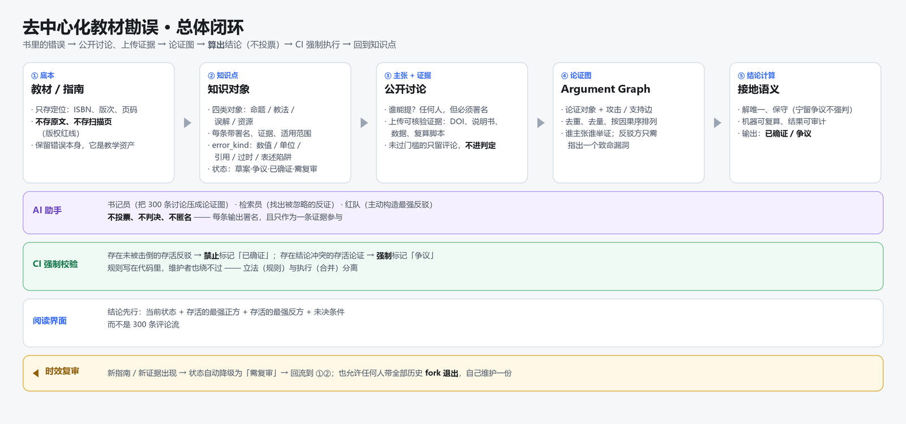
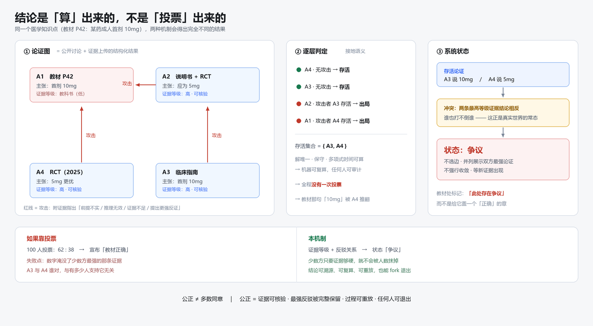
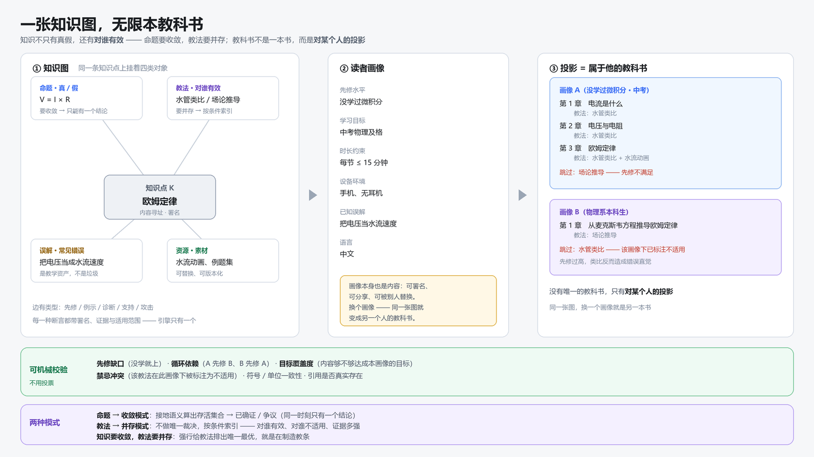

# Scholia · 去中心化的教科书与知识库

> **一张知识图，无限本教科书。**
>
> 没有任何权威主副本；任何人都能为同一张图写出属于自己的那本教科书。

当前状态：**抽象设计完成，尚未实现任何代码。**

---

## 名字

**Scholia** —— 古希腊学者写在权威抄本**页边**上的注疏。

那些注疏有个关键特征：**它们不在正文里，而正文本身不允许被改写。** 一代代读者把订正、质疑、出处写在页边，与正文并行流传至今。这正是这套系统在做的事：

| 抄本时代 | 本项目 |
|---|---|
| 正文不可改 | 教材 / 底本**只存定位，不入库** |
| 订正写在页边 | 勘误层：论证 + 证据 + 反驳 |
| 注疏有署名 | `author` 字段 + 提交签名，不可匿名 |
| 注疏之间互相驳斥 | `attacks` 边 + 接地语义求值 |
| 跟谁的注疏，就读到哪个版本 | **读者画像 → 投影 → 属于他的教科书** |

> [!NOTE]
> 项目标识（front-matter 的 `id`）**刻意不含项目名**：写作 `kb:physics:ohm-law`。
> 因为 fork 出去之后标识必须保持不变——这是「可退出」不变量的前提。

## 这是什么

教材里有错，老师口头告诉你哪一处错了——这个现象被抽象之后，得到的不是"一个大家共同编辑的维基"，而是：

- 协议层只回答三件事：**这份内容是谁署名的？它从哪里来？它和谁冲突？**
- 协议层**永不回答**"什么是真的"。真伪由每个读者在本地视图里裁决。
- 知识图是唯一的；教科书是这张图**针对某个具体读者**的一次投影。

## 三张图

| 图 | 回答的问题 |
|---|---|
|  | **怎么运转**：从底本 → 知识点 → 讨论与证据 → 论证图 → 结论计算 → CI 强制 → 时效复审 |
|  | **结论怎么算出来**：四种论证的攻击关系、逐层判定，以及为什么不能投票 |
|  | **怎么变成某个人的教科书**：四类知识对象、读者画像、投影、两种判定模式 |

## 三条最要紧的判断

1. **投票不能决定真理。** 投票只用来分配注意力；结论由「证据等级 + 反驳关系」按接地语义**算**出来，任何人重跑一遍都得到同样结果。
2. **知识要收敛，教法要并存。** 命题必须收敛成一个结论；教法**禁止**排唯一最优——强行排名就是制造教条。
3. **规则即代码，立法与执行分离。** 校验规则写在 CI 里，执行合并的人不能绕过它。

## 文档

| 文件 | 内容 |
|---|---|
| [抽象设计](docs/00-抽象设计.md) | 公理、不变量、分层、知识对象模型、判定引擎、投影机制、治理、法律红线、路线图 |
| [GitHub 落地设计](docs/01-GitHub落地设计.md) | Issues / PR / Discussions 三通道分工、仓库结构、模板、标签、Actions 清单、分支保护护栏 |
| [Markdown 存储格式](docs/02-Markdown存储格式.md) | `.md` + front-matter 规范、五类对象模板、状态取值约束、GitHub 原生特性用法 |
| [图表生成脚本](docs/diagrams/build_diagrams.py) | 三张图的源码（Pillow，无第三方依赖，改字改色重跑即可） |

## 知识以 Markdown 存储

**一个知识点 = 一个 `.md` 文件**：front-matter 存机器需要的，正文存人需要的。

- GitHub **原生渲染**——打开网页就能看懂，不需要任何工具
- 论证图用 **Mermaid** 写在正文里，GitHub 直接画出来
- 争议用 **GitHub alert**（`> [!WARNING]`）显著标出
- diff 看得见改了哪句话，而不只是哪个字段变了
- **格式先定，自动化后加**——将来加求值器不用改一个字的格式

### 示例知识库（物理 · 试点）

```
knowledge/
├─ README.md                     总索引
└─ 物理/
   ├─ README.md                 学科索引 + 先修关系图
   ├─ 命题/  电流 · 电压 · 电阻 · 欧姆定律
   ├─ 教法/  水管类比            （含禁忌：对物理系本科生不适用）
   ├─ 误解/  把电压当成水流速度
   ├─ 路径/  初中电学入门 5 讲    （含自检清单）
   └─ 资源/  水流动画
证据/
├─ README.md                     证据索引 + 等级说明
└─ 导体U-I数据.csv               可复算的原始数据
```

> [!IMPORTANT]
> **教法、误解、资源禁止使用「已确证」状态**——它们不存在唯一正确。
> 这是公理 A2「知识要收敛，教法要并存」在数据结构上的直接体现。

## 载体的枢纽：三个通道的严格分工

| 通道 | 语义 | 是否影响结论 |
|---|---|---|
| **Discussions** | 探索、方法论、提问——还没成型的想法 | **不影响**（防止讨论区污染判定） |
| **Issues** | 一个**可判定的问题**，触发工作流 | 间接（产出证据与论证） |
| **PR** | 具体的修改 + 证据 | **唯一能改变结论的通道** |

两条护栏：**`status` 由 CI 计算写入，人工 PR 不得修改**；**👍 reactions 只作注意力排序，绝不作判定依据**。

## 未决问题

1. **收敛器**用哪种权力结构：纯规则自动合并 / 规则 + 领域编辑 / 规则 + 轮值裁决
2. **先修关系**三来源（结构抽取、学习数据、人工标注）的权重
3. 是否引入经济 / 资助层
4. **试点学科**：建议选对错可被程序判定的科目（数学 / 计算机 / 物理），不要从医学起步
5. 读者画像的匿名化标准

## 红线（不可协商）

- **绝不上传教材全文或扫描页**，只存页码定位、短引用、原创摘要与结论
- 学情数据是敏感个人信息：默认本地、加密、可加密擦除
- 勘误必须自洽可验证、导读可自建、**裸读模式永远可用**

## 许可

| 部分 | 许可 |
|---|---|
| 知识内容（`knowledge/` `证据/` `画像/` `投影/` `docs/00` `docs/01`） | **CC BY-SA 4.0** —— [LICENSE](LICENSE) |
| 代码与格式规范（`tools/` `docs/diagrams/` `docs/02-Markdown存储格式.md`） | **MIT** —— [LICENSE-CODE](LICENSE-CODE) |

**为什么分开授权：**

- **知识内容用 ShareAlike**：任何人都可以拿去用、改、甚至卖，但**衍生品必须同样开放**。这是为了防止社区持续维护的勘误成果被封闭圈占——本项目的全部价值来自持续维护的证据与反驳。
- **格式规范用 MIT**：如果格式本身带共享条款，别人实现它就会有法律顾虑——**那等于亲手阻止自己的格式成为标准**。

**刻意避开的选项：`CC BY-NC`（非商业）。** NC 条款措辞模糊（学校机构付费使用算不算商业？），且会切断与 OpenStax、维基百科等生态的互操作。

署名机制见 [CONTRIBUTORS.md](CONTRIBUTORS.md)。**使用前请务必阅读 [DISCLAIMER.md](DISCLAIMER.md)**——许可协议解决版权问题，免责声明解决责任问题，两者不是一回事。
