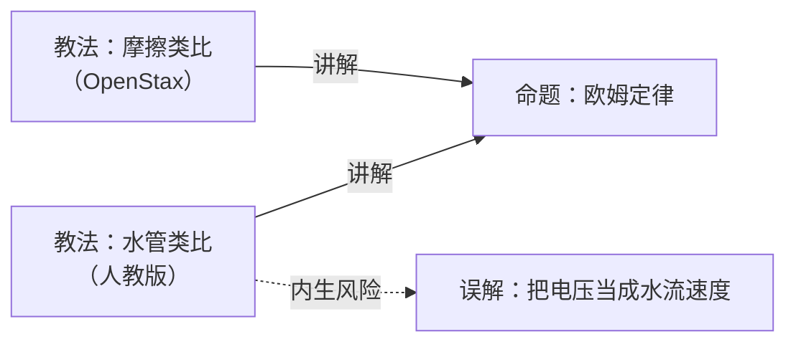

# 物理

## 命题

| 条目 | 状态 | 来源 |
|---|---|---|
| [欧姆定律](命题/欧姆定律.md) | 已确证 ⚠️示例 | 人教版 + 实验数据 |
| [电压符号 U 与 V 的中英文教材差异](命题/电压符号差异.md) | 待审 | 跨教材对比 |
| [欧姆定律局限性的呈现位置差异](命题/局限性的位置.md) | 待审 | 跨教材对比 |

## 教法

| 条目 | 状态 | 针对人群 | 禁忌 |
|---|---|---|---|
| [水管类比](教法/水管类比.md) | 有效 ⚠️示例 | 无微积分基础 | 物理系本科生（会造成错误直觉） |
| [摩擦类比](教法/摩擦类比.md) | 有效 | 已建立力与能量概念 | 未建立「电阻是材料属性」者；学超导者 |

## 误解

| 条目 | 状态 | 来源 |
|---|---|---|
| [把电压当成水流速度](误解/把电压当成水流速度.md) | 有效 ⚠️示例 | 水管类比使用过度 |

> ⚠️ 标记者为**示例条目**，作者是虚构账号，详见 [knowledge/README.md](../README.md)。

## 教法并存：一个真实案例

**同一个知识点，两本教材选了不同的类比，而且都有效。**

- **水管类比**强在**直观**——水压/水流/管径是生活经验
- **摩擦类比**强在**解释发热**——电荷与原子碰撞把能量传给导体

「哪个更好」是个错问题。正确的问题是**「对谁、在什么条件下」**——这正是公理 A2
「知识要收敛，教法要并存」的实证，而且它**不是推演出来的，是两本真教材给出的**。

## 三个核心区分

- 「欧姆定律」是**命题** → 有真假，必须**收敛**成一个结论
- 「水管类比 / 摩擦类比」是**教法** → 只对特定人群有效，必须**并存**，不许排名
- 「把电压当成水流速度」是**误解** → 它是教法的**副产品**，是资产，不是垃圾
