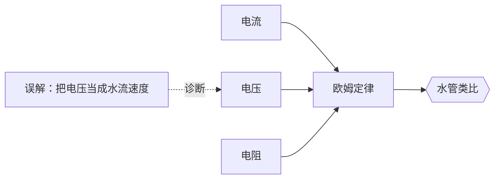

# 物理

## 先修关系概览

## 命题

| 条目 | 状态 | 先修 |
|---|---|---|
| [电流](命题/电流.md) | 已确证 | — |
| [电压](命题/电压.md) | 草案 | — |
| [电阻](命题/电阻.md) | 草案 | — |
| [欧姆定律](命题/欧姆定律.md) | 已确证 | 电流 · 电压 · 电阻 |

## 教法

| 条目 | 状态 | 针对学段 | 禁忌 |
|---|---|---|---|
| [水管类比](教法/水管类比.md) | 有效 | 无微积分基础 | 物理系本科生（会造成错误直觉） |

## 误解

| 条目 | 状态 |
|---|---|
| [把电压当成水流速度](误解/把电压当成水流速度.md) | 有效 |

## 路径

| 条目 | 状态 | 目标 |
|---|---|---|
| [初中电学入门 5 讲](路径/初中电学入门5讲.md) | 有效 | 中考物理及格 |

## 资源

| 条目 | 状态 | 配合教法 | 授权 |
|---|---|---|---|
| [水流动画](资源/水流动画.md) | 有效 | [水管类比](教法/水管类比.md) | CC-BY-4.0 |
