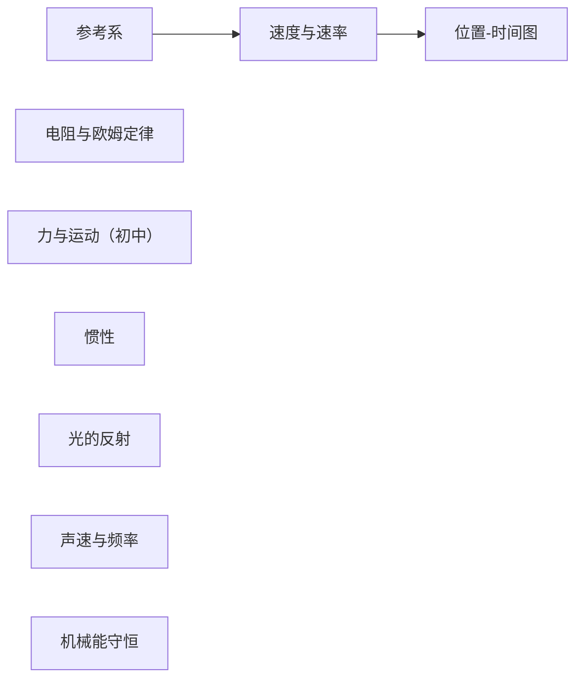
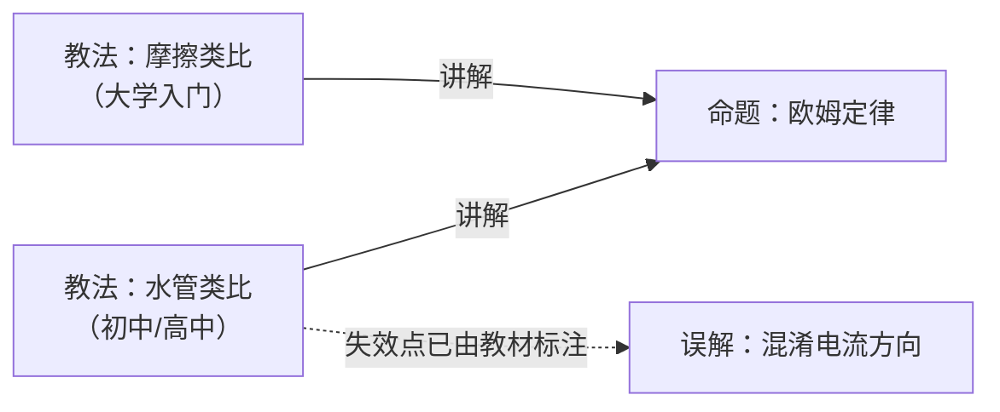

# 物理

## 知识点（概念节点 · 先修关系的载体）

| 知识点 | 学段 | 先修 | 挂在其下的教法 | 误解 |
|---|---|---|---|---|
| [力与运动（初中）](知识点/力与运动-初中.md) | **初中** | — | 现象探究循环 | — |
| [惯性](知识点/惯性.md) | 高中 | —（与初中的关系是**进阶**，非先修） | BL · AL 共 2 条 | 运动物体自然慢下来 |
| [参考系](知识点/参考系.md) | 高中 | — | BL · OL · AL 共 3 条 | 参考系当成背景 |
| [速度与速率](知识点/速度与速率.md) | 高中 | 参考系 | BL/OL · AL 共 2 条 | — |
| [位置-时间图](知识点/位置-时间图.md) | 高中 | 速度与速率 | BL/OL · AL 共 2 条 | — |
| [光的反射](知识点/光的反射.md) | 高中 | —（前置是**初中几何**，不归物理） | BL · AL 共 2 条 | — |
| [声速与频率](知识点/声速与频率.md) | 高中 | — | BL · AL 共 2 条 | — |
| [机械能守恒](知识点/机械能守恒.md) | 高中 | — | BL · OL 共 2 条 | 运动物体自然慢下来 |
| [电阻与欧姆定律](知识点/电阻与欧姆定律.md) | 初中至高中 | — | 水管类比 · 摩擦类比 共 2 条 | 混淆电流方向 |

> [!NOTE]
> **跨学段关系已定规则**（`FORMAT.md` §4）：`先修` **允许跨学段**，但会触发**警告**，
> 提醒作者确认这是「概念前置」而非「进阶」。
>
> 本库目前**没有**表达「进阶」关系的手段。`力与运动（初中）` 与 `惯性` 就是这种情况——
> 已确认是**进阶**，故**不建边**，只在条目正文里说明。见
> [惯性](知识点/惯性.md) 的「关联」一节。

> [!IMPORTANT]
> **`先修` 边只连知识点，不连教法。** 因为教法是 **(知识点 × 水平档)** 的组合，
> 同一知识点有多个文件；把先修挂在教法上会把水平档绑进先修关系。
> 这条规则由 [`tools/kbcheck.py`](../../tools/kbcheck.py) 强制——**已注入错误验证过**。

## 命题

| 条目 | 状态 | 来源 |
|---|---|---|
| [欧姆定律](命题/欧姆定律.md) | 待审 | 可复算实验数据 + CC BY 教材 |
| [电压符号 U 与 V 的中英文教材差异](命题/电压符号差异.md) | 待审 | 跨教材对比 |
| [欧姆定律局限性的呈现位置差异](命题/局限性的位置.md) | 待审 | 跨教材对比 |
| [类比的选择与学段相关（假设）](命题/类比选择与学段相关.md) | **失据** ⚠️ | 跨教材对比（n=2）· **A1 已被击倒** |
| [教材内建按学习者水平分档的教学变体](命题/教材内建分组教学变体.md) | 待审 | 全量提取 580 条教学提示 |
| [n=2 无法在多个同样变化的变量之间做归因](命题/两个样本无法归因.md) | 待审 | 对上述命题 A1 的**攻击** |

> [!IMPORTANT]
> **本库第一条被攻击的论证（2026-10-05）。**
>
> [两个样本无法归因](命题/两个样本无法归因.md#a1) 击倒了
> [类比的选择与学段相关](命题/类比选择与学段相关.md#a1) 的 A1，
> 该条目状态由 `待审` 变为 **`失据`**。
>
> **攻击没有说「学段无关」**——它说的是「唯一显著差别是学段」这句话不成立：
> 两本书之间同时变化的量至少还有**作者团队、系列定位、成书年代**，
> 在 n=2 时它们与「学段」**同样吻合数据**。
>
> 这是「论证被攻击 → 求存活集合 → 定状态」这条主链路的**第一次真实执行**。

## 教法

| 条目 | 状态 | 针对人群 | `禁忌`（对谁不适用） |
|---|---|---|---|
| [现象探究循环](教法/现象探究循环.md) | 有效 | 初中 | 无可呈现现象（中）；本档以外（弱） |
| [水管类比](教法/水管类比.md) | 有效 | 有水流生活经验、未学电磁场 | 本档以外（弱） |
| [摩擦类比](教法/摩擦类比.md) | 有效 | 已建立力与能量概念 | 未建立「电阻是材料属性」者；学超导者 |
| [惯性 · BL：定义](教法/惯性-BL-定义.md) | 有效 | 低于年级水平（BL） | 未知牛顿第一定律者（中）；本档以外（弱） |
| [惯性 · AL：两车探究](教法/惯性-AL-两车探究.md) | 有效 | 进阶（AL） | 不清楚「运动状态」者（中）；本档以外（弱） |
| [光的反射 · BL：几何前提](教法/光的反射-BL-几何前提.md) | 有效 | 低于年级水平（BL） | **未掌握几何「角」的概念（强·教材明示）**；本档以外（弱） |
| [光的反射 · AL：相互作用](教法/光的反射-AL-相互作用.md) | 有效 | 进阶（AL） | 未掌握反射定律者（中）；本档以外（弱） |
| [声速与频率 · BL：需介质](教法/声速与频率-BL-需介质.md) | 有效 | 低于年级水平（BL） | 未建立「波」概念者（中）；本档以外（弱） |
| [声速与频率 · AL：雷声滞后](教法/声速与频率-AL-雷声滞后.md) | 有效 | 进阶（AL） | 无雷雨/烟花经验者（中）；本档以外（弱） |
| [机械能守恒 · BL：单位区分](教法/机械能守恒-BL-单位区分.md) | 有效 | 低于年级水平（BL） | 未学过功率者（中）；本档以外（弱） |
| [机械能守恒 · OL：摩擦生热](教法/机械能守恒-OL-摩擦生热.md) | 有效 | 年级水平（OL） | 不知摩擦力者（中）；本档以外（弱） |
| [参考系 · BL：多参考点观察](教法/参考系-BL-多参考点观察.md) | 有效 | 低于年级水平（BL） | 本档以外（弱） |
| [参考系 · OL：提问引导](教法/参考系-OL-提问引导.md) | 有效 | 年级水平（OL） | **教材未标注**（缺口，非「已确认适用」） |
| [参考系 · AL：生成式下定义](教法/参考系-AL-生成式下定义.md) | 有效 | 进阶（AL） | **非惯性参考系（强·教材明示）**；本档以外（弱） |
| [速度与速率 · BL/OL：日常用语切入](教法/速度与速率-BLOL-日常用语切入.md) | 有效 | 低于年级 / 年级水平 | 本档以外（弱） |
| [速度与速率 · AL：追问与反例](教法/速度与速率-AL-追问与反例.md) | 有效 | 进阶（AL） | 本档以外（弱） |
| [位置-时间图 · BL/OL：情境叙事](教法/位置时间图-BLOL-情境叙事.md) | 有效 | 低于年级 / 年级水平 | 本档以外（弱） |
| [位置-时间图 · AL：边界情形追问](教法/位置时间图-AL-边界情形追问.md) | 有效 | 进阶（AL） | 本档以外（弱） |

> [!NOTE]
> **上表是 `禁忌`（对谁不适用），不是风险。** 每条的风险见条目内的 `## 风险` 小节。
> 只有两条拿到**强**证据：`光的反射 · BL`（几何前提，教材明示）与
> `参考系 · AL`（非惯性参考系，教材明示）。其余标注为**弱**——
> 「教材没提别的档位」不等于「别的档位不适用」。

### 同一知识点的分档对照

教材对**同一个知识点**给出不同档位的做法，三档的差别**不在难度，在认知负荷放在哪**：

| 知识点 | BL（低于年级） | OL（年级） | AL（进阶） |
|---|---|---|---|
| 参考系 | 实物操作 + **多参考点并置**制造矛盾 | **提问链**引导到「需要起点」 | 学生**自己下定义** → 结对 → 全班比较 |
| 位置-时间图 | 情境叙事 → 学生画情境 → 再画图 | 同 BL，但可加问「零点是否影响图」 | **边界情形逼问**：为什么可以忽略曲线 |
| 惯性 | 先命名「保持运动状态」的性质 | —（教材未给 OL 档） | **两辆小车探究**：惯性取决于什么 |
| 光的反射 | 先补几何 + 说破「弹跳是简化」 | —（教材未给 OL 档） | 把反射放回吸收/透射的完整图景 |
| 声速与频率 | 先立「机械波需介质」+ 读表 | —（教材未给 OL 档） | **先猜声速** → 用雷声滞后推出有限性 |
| 机械能守恒 | 分清能量/力/功率的量纲 | **用摩擦生热堵「能量去哪了」** | —（教材未给 AL 档） |

> [!IMPORTANT]
> **三档不是「同一做法的由浅入深」，而是三种不同的做法。**
> 教师干预方向甚至相反：BL 档怕学生**说不出来**，AL 档怕学生**说得太多收不住**。

## 误解

| 条目 | 状态 | 来源 |
|---|---|---|
| [把电流方向当成电子实际移动方向](误解/电流方向与电子流向混淆.md) | 有效 | 教材明确标注为需强调项 |
| [把参考系当成「背景」而不是「观察视角」](误解/参考系当成背景.md) | 有效 | 教材 Misconception 标注 + **自带可当场诊断的演示** |

## 路径

| 条目 | 状态 | 目标 | 自检 |
|---|---|---|---|
| [运动学入门（低于年级水平）](路径/运动学入门-BL.md) | 有效 | 能用位置-时间图描述一个简单运动 | ✅ **3 项机械校验 + 1 项人工判定** |
| | | | 先修缺口 ✅ · 循环依赖 ✅ · **目标覆盖度 4/4 ✅** · 禁忌冲突 ✅（弱） |

> [!NOTE]
> 这条路径的 `自检` 曾暴露三个 schema 问题，**现已全部解决**（方案 A + Issue #13 + outcomes 机制）：
>
> 1. ✅ `edges.先修` 有了承载体（`知识点` 层）→ 前两项转为**机器校验**
> 2. ✅ `禁忌` 与 `风险` 拆分并标注证据强度 →「禁忌冲突」**能判定**
> 3. ✅ `先修` 粒度解决（只连知识点）
> 4. ✅ **目标覆盖度**有了机制（`outcomes` + 编排表的 `覆盖` 列）→ 前四项自检里最后一项补上

> [!CAUTION]
> 这条路径的 `自检` **暴露了三个 schema 问题**：
>
> 1. `edges.先修` 全库为空 → 前两项自检退化成人工断言
> 2. `禁忌` 语义混用（**人群禁忌** vs **风险**）→「禁忌冲突」填不了
> 3. **`先修` 的粒度对不上** —— 先修是**知识点之间**的关系，而 `edges` 挂在
>    **(知识点 × 水平档)** 的条目上。**修问题一之前必须先回答这个。**
>
> 详见 [路径条目正文](路径/运动学入门-BL.md#自检暴露的三个-schema-问题)。
> **这不是路径写错了，是对象模型没建完。**

## 教法并存：一个真实案例

**同一个知识点，不同教材选了不同的类比，而且都有效。**

- **水管类比**强在**直观**——水压/水流/砂滤器是生活经验
- **摩擦类比**强在**解释发热**——电荷与原子碰撞把能量传给导体

「哪个更好」是个错问题。正确的问题是**「对谁、在什么条件下」**——这是公理 A2
「知识要收敛，教法要并存」的实证，而且它**不是推演出来的，是三本真教材给出的**。

> [!NOTE]
> 进一步观察：两本 OpenStax 教材里，**高中**用水的类比、**大学**用摩擦的类比。
> 这提示类比选择可能与**学段**相关——但样本只有 2 本，
> 见 [命题：类比的选择与学段相关](命题/类比选择与学段相关.md)，**该假设尚未成立**。

## 三个核心区分

- 「欧姆定律」是**命题** → 有真假，必须**收敛**成一个结论
- 「水管类比 / 摩擦类比」是**教法** → 只对特定人群有效，必须**并存**，不许排名
- 「混淆电流方向」是**误解** → 它是类比教学的**副产品**，是资产，不是垃圾

> [!IMPORTANT]
> 本目录 **7 条全部为真实来源**，无示例条目。
> 早期 3 条示例（虚构作者 + 构造数据）已于 2026-10-05 全部重写或删除。
