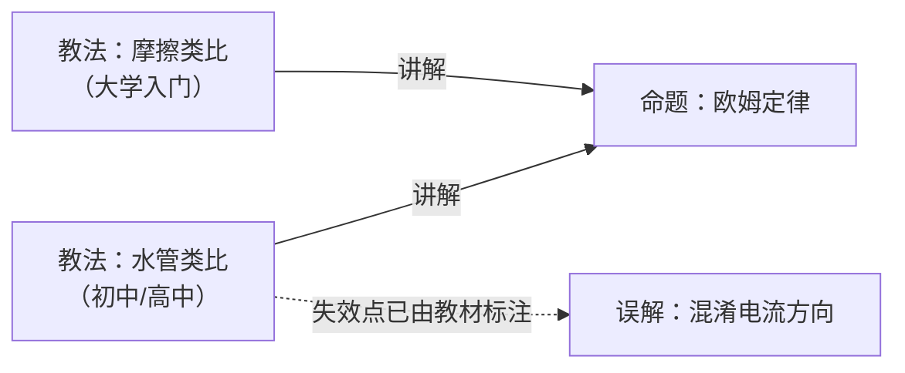

# 物理

## 命题

| 条目 | 状态 | 来源 |
|---|---|---|
| [欧姆定律](命题/欧姆定律.md) | 待审 | 可复算实验数据 + CC BY 教材 |
| [电压符号 U 与 V 的中英文教材差异](命题/电压符号差异.md) | 待审 | 跨教材对比 |
| [欧姆定律局限性的呈现位置差异](命题/局限性的位置.md) | 待审 | 跨教材对比 |
| [类比的选择与学段相关（假设）](命题/类比选择与学段相关.md) | 待审 | 跨教材对比（**n=2，只是假设**） |
| [教材内建按学习者水平分档的教学变体](命题/教材内建分组教学变体.md) | 待审 | 全量提取 580 条教学提示 |

## 教法

| 条目 | 状态 | 针对人群 | 禁忌 |
|---|---|---|---|
| [水管类比](教法/水管类比.md) | 有效 | 有水流生活经验、未学电磁场 | 4 条，**均出自教材自身的教学指引**（见条目） |
| [摩擦类比](教法/摩擦类比.md) | 有效 | 已建立力与能量概念 | 未建立「电阻是材料属性」者；学超导者 |

## 误解

| 条目 | 状态 | 来源 |
|---|---|---|
| [把电流方向当成电子实际移动方向](误解/电流方向与电子流向混淆.md) | 有效 | 教材明确标注为需强调项 |

## 教法并存：一个真实案例

**同一个知识点，不同教材选了不同的类比，而且都有效。**

- **水管类比**强在**直观**——水压/水流/砂滤器是生活经验
- **摩擦类比**强在**解释发热**——电荷与原子碰撞把能量传给导体

「哪个更好」是个错问题。正确的问题是**「对谁、在什么条件下」**——这是公理 A2
「知识要收敛，教法要并存」的实证，而且它**不是推演出来的，是三本真教材给出的**。

> [!NOTE]
> 进一步观察：两本 OpenStax 教材里，**高中**用水的类比、**大学**用摩擦的类比。
> 这提示类比选择可能与**学段**相关——但样本只有 2 本，
> 见 [命题：类比的选择与学段相关](命题/类比选择与学段相关.md)，**该假设尚未成立**。

## 三个核心区分

- 「欧姆定律」是**命题** → 有真假，必须**收敛**成一个结论
- 「水管类比 / 摩擦类比」是**教法** → 只对特定人群有效，必须**并存**，不许排名
- 「混淆电流方向」是**误解** → 它是类比教学的**副产品**，是资产，不是垃圾

> [!IMPORTANT]
> 本目录 **7 条全部为真实来源**，无示例条目。
> 早期 3 条示例（虚构作者 + 构造数据）已于 2026-10-05 全部重写或删除。
