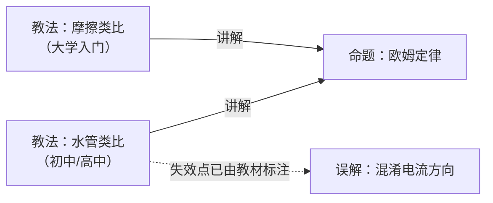

# 物理

## 命题

| 条目 | 状态 | 来源 |
|---|---|---|
| [欧姆定律](命题/欧姆定律.md) | 待审 | 可复算实验数据 + CC BY 教材 |
| [电压符号 U 与 V 的中英文教材差异](命题/电压符号差异.md) | 待审 | 跨教材对比 |
| [欧姆定律局限性的呈现位置差异](命题/局限性的位置.md) | 待审 | 跨教材对比 |
| [类比的选择与学段相关（假设）](命题/类比选择与学段相关.md) | 待审 | 跨教材对比（**n=2，只是假设**） |
| [教材内建按学习者水平分档的教学变体](命题/教材内建分组教学变体.md) | 待审 | 全量提取 580 条教学提示 |

## 教法

| 条目 | 状态 | 针对人群 | 禁忌 |
|---|---|---|---|
| [水管类比](教法/水管类比.md) | 有效 | 有水流生活经验、未学电磁场 | 4 条，**均出自教材自身的教学指引**（见条目） |
| [摩擦类比](教法/摩擦类比.md) | 有效 | 已建立力与能量概念 | 未建立「电阻是材料属性」者；学超导者 |
| [参考系 · BL：多参考点观察](教法/参考系-BL-多参考点观察.md) | 有效 | 低于年级水平（BL） | 学生把参考系当「背景」；只演示不点破 |
| [参考系 · OL：提问引导](教法/参考系-OL-提问引导.md) | 有效 | 年级水平（OL） | **教材未标注**（缺口，非「已确认适用」） |
| [参考系 · AL：生成式下定义](教法/参考系-AL-生成式下定义.md) | 有效 | 进阶（AL） | 超出惯性参考系范围；定义收敛不了 |
| [速度与速率 · BL/OL：日常用语切入](教法/速度与速率-BLOL-日常用语切入.md) | 有效 | 低于年级 / 年级水平 | **课堂语言本身在强化混淆**（针对教师） |
| [速度与速率 · AL：追问与反例](教法/速度与速率-AL-追问与反例.md) | 有效 | 进阶（AL） | 把「平均」当算术平均；只给反例不给一般式 |
| [位置-时间图 · BL/OL：情境叙事](教法/位置时间图-BLOL-情境叙事.md) | 有效 | 低于年级 / 年级水平 | 以为零点不影响图；跳过「画情境」 |
| [位置-时间图 · AL：边界情形追问](教法/位置时间图-AL-边界情形追问.md) | 有效 | 进阶（AL） | 过早引入加速度；把「理想化」当成「假」 |

### 同一知识点的分档对照

教材对**同一个知识点**给出不同档位的做法，三档的差别**不在难度，在认知负荷放在哪**：

| 知识点 | BL（低于年级） | OL（年级） | AL（进阶） |
|---|---|---|---|
| 参考系 | 实物操作 + **多参考点并置**制造矛盾 | **提问链**引导到「需要起点」 | 学生**自己下定义** → 结对 → 全班比较 |
| 位置-时间图 | 情境叙事 → 学生画情境 → 再画图 | 同 BL，但可加问「零点是否影响图」 | **边界情形逼问**：为什么可以忽略曲线 |

> [!IMPORTANT]
> **三档不是「同一做法的由浅入深」，而是三种不同的做法。**
> 教师干预方向甚至相反：BL 档怕学生**说不出来**，AL 档怕学生**说得太多收不住**。

## 误解

| 条目 | 状态 | 来源 |
|---|---|---|
| [把电流方向当成电子实际移动方向](误解/电流方向与电子流向混淆.md) | 有效 | 教材明确标注为需强调项 |
| [把参考系当成「背景」而不是「观察视角」](误解/参考系当成背景.md) | 有效 | 教材 Misconception 标注 + **自带可当场诊断的演示** |

## 路径

| 条目 | 状态 | 目标 | 自检 |
|---|---|---|---|
| [运动学入门（低于年级水平）](路径/运动学入门-BL.md) | 有效 | 能用位置-时间图描述一个简单运动 | ⚠️ **2 项通过 · 1 项人工断言 · 1 项填不了** |

> [!CAUTION]
> 这条路径的 `自检` **暴露了三个 schema 问题**：
>
> 1. `edges.先修` 全库为空 → 前两项自检退化成人工断言
> 2. `禁忌` 语义混用（**人群禁忌** vs **风险**）→「禁忌冲突」填不了
> 3. **`先修` 的粒度对不上** —— 先修是**知识点之间**的关系，而 `edges` 挂在
>    **(知识点 × 水平档)** 的条目上。**修问题一之前必须先回答这个。**
>
> 详见 [路径条目正文](路径/运动学入门-BL.md#自检暴露的三个-schema-问题)。
> **这不是路径写错了，是对象模型没建完。**

## 教法并存：一个真实案例

**同一个知识点，不同教材选了不同的类比，而且都有效。**

- **水管类比**强在**直观**——水压/水流/砂滤器是生活经验
- **摩擦类比**强在**解释发热**——电荷与原子碰撞把能量传给导体

「哪个更好」是个错问题。正确的问题是**「对谁、在什么条件下」**——这是公理 A2
「知识要收敛，教法要并存」的实证，而且它**不是推演出来的，是三本真教材给出的**。

> [!NOTE]
> 进一步观察：两本 OpenStax 教材里，**高中**用水的类比、**大学**用摩擦的类比。
> 这提示类比选择可能与**学段**相关——但样本只有 2 本，
> 见 [命题：类比的选择与学段相关](命题/类比选择与学段相关.md)，**该假设尚未成立**。

## 三个核心区分

- 「欧姆定律」是**命题** → 有真假，必须**收敛**成一个结论
- 「水管类比 / 摩擦类比」是**教法** → 只对特定人群有效，必须**并存**，不许排名
- 「混淆电流方向」是**误解** → 它是类比教学的**副产品**，是资产，不是垃圾

> [!IMPORTANT]
> 本目录 **7 条全部为真实来源**，无示例条目。
> 早期 3 条示例（虚构作者 + 构造数据）已于 2026-10-05 全部重写或删除。
