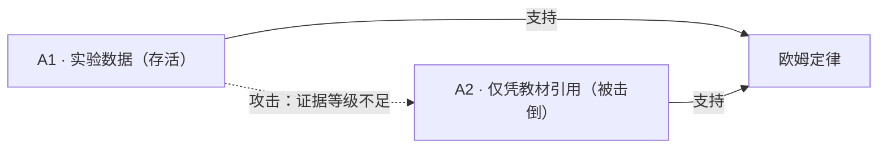

## 陈述

温度不变时，导体中的电流与两端电压成正比，比例常数为电阻：`U = I × R`。

## 依据

| 编号 | 类型 | 等级 | 可核验定位 | 时间 | 复核 |
|---|---|---|---|---|---|
| ev-001 | 教材 | 低 | 《义务教育教科书·物理》九年级全一册，人教版，2013，P.79 | 2013 | @alice |
| ev-002 | 实验数据 | 高 | [导体U-I数据.csv](../../../证据/导体U-I数据.csv)（可复算） | 2026 | @bob |

## 论证

### A1 · 实验数据支持（存活）

- **主张**：该陈述与可控实验数据一致
- **前提**：对同一导体在不同电压下测得电流（ev-002，温度 20 °C）
- **推理**：温度恒定时 U-I 图像为过原点的直线 ⇒ `U ∝ I`；斜率恒定 ⇒ 比例常数为电阻
- **证据**：ev-002
- **被攻击**：无
- **署名**：@bob · 2026-09-10

### A2 · 仅凭教材引用（被击倒）

- **主张**：教材如此写，故成立
- **前提**：教材 P.79 的表述（ev-001）
- **推理**：教材是权威来源
- **证据**：ev-001
- **被攻击**：A1 以「证据等级不足」攻击。教材在证据金字塔中等级很低——**这正是本项目存在的理由**
- **署名**：@carol · 2026-09-09

## 适用范围提醒

> [!IMPORTANT]
> 本条以**温度恒定**为前提。为小灯泡（灯丝温度剧烈变化）等非线性元件套用 `U = I × R` 是常见误用。

## 变更记录

| 日期 | 操作 | 依据 | 谁 |
|---|---|---|---|
| 2026-09-09 | 建立条目 | #38 | @carol |
| 2026-09-10 | 补充实验证据 ev-002 与论证 A1 | #39 | @bob |
| 2026-09-15 | 状态 → 已确证 | 存活论证 A1；A2 被 A1 击倒（#42） | @alice |
