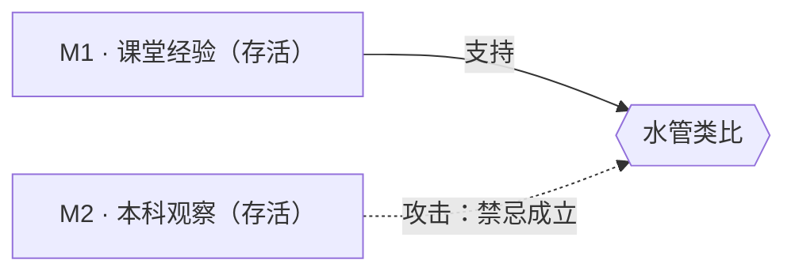

## 做法

把电压比作水压、电流比作水流、电阻比作水管的粗细。

## 适用条件

| 维度 | 取值 |
|---|---|
| 先修水平 | 未学微积分 |
| 年龄段 | 13–16 |
| 班级规模 | 不限 |
| 设备 | 不限，有动画更好 |
| 语言 | 中文 |

## 禁忌

> [!CAUTION]
> **方法没有对错，只有对谁、在什么条件下。**
> 说不清禁忌，说明证据还不够。

| 对象 | 理由 | 证据 |
|---|---|---|
| 物理系本科生 | 先修过高，类比会固化「电压即水流速度」的错误直觉，干扰后续场论学习 | ev-010 |

## 证据

| 编号 | 类型 | 等级 | 定位 | 样本 |
|---|---|---|---|---|
| ev-009 | 课堂经验 | 低 | 某校初三 2 个班，后测正确率提升 | n = 92 |
| ev-010 | 教学观察 | 低 | 本科物理课，类比对后续场论学习产生干扰 | n = 1 个班 |

## 论证

### M1 · 课堂经验支持（存活）

- **主张**：对无微积分基础的初中生，该类比提高首轮理解正确率
- **前提**：2 个班的对照观察（ev-009，n = 92）
- **推理**：类比降低抽象门槛 ⇒ 首轮理解正确率上升
- **被攻击**：无
- **署名**：@carol · 2026-09-08

### M2 · 本科观察（存活，构成禁忌）

- **主张**：该教法对高先修人群**不适用**
- **前提**：本科物理课的观察记录（ev-010）
- **推理**：类比提供了一个错误的物理模型，先修越高，错误模型越难被替换
- **被攻击**：无
- **署名**：@dave · 2026-09-15

> [!NOTE]
> M1 与 M2 并不冲突，它们**各自成立、指向不同人群**。
> 这正是教法要「并存」而不是「收敛」的原因——这里没有唯一最优。

## 变更记录

| 日期 | 操作 | 依据 | 谁 |
|---|---|---|---|
| 2026-09-08 | 建立条目 + 论证 M1 | #31 | @carol |
| 2026-09-15 | 补充禁忌与论证 M2 | 本科观察 ev-010（#45） | @dave |
